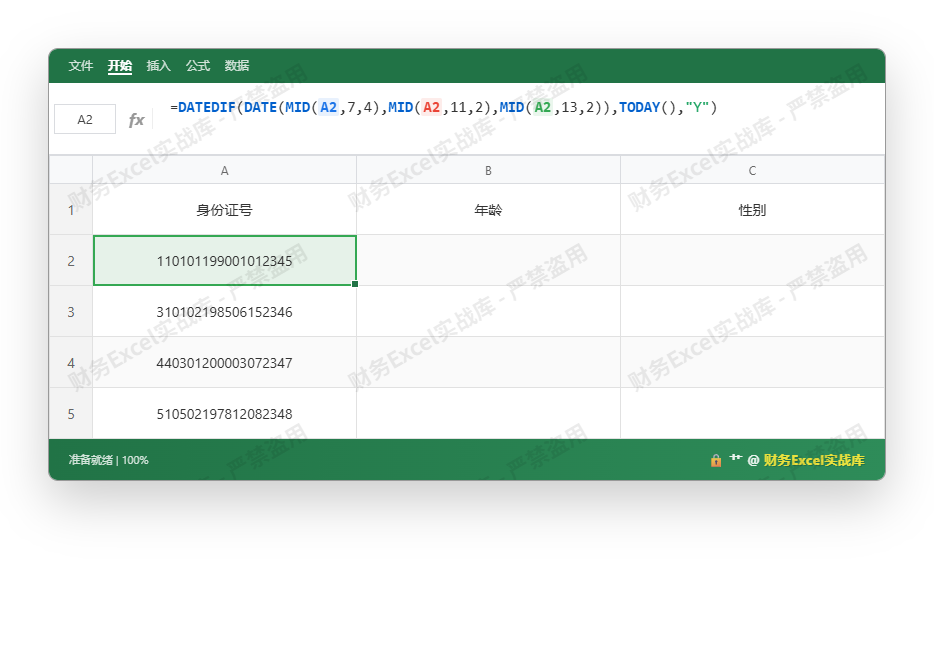
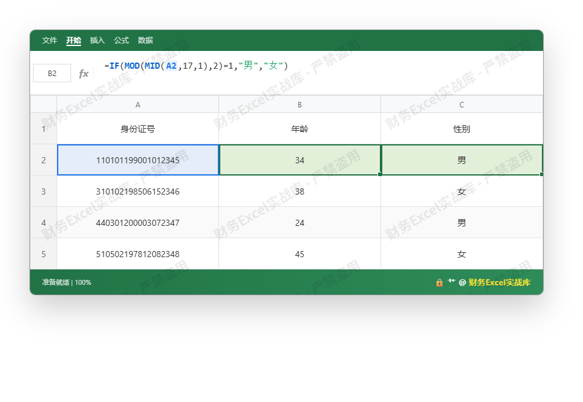

兄弟，别再傻傻手工录入了！一键搞定，早点下班。

### 【先扔公式，直接复制】
**年龄公式（B2单元格）：**
```excel
=DATEDIF(DATE(MID(A2,7,4),MID(A2,11,2),MID(A2,13,2)),TODAY(),"Y")
```
**性别公式（C2单元格）：**
```excel
=IF(MOD(MID(A2,17,1),2)=1,"男","女")
```
复制粘贴，下拉填充，搞定！下面看图说话。

---

### 【看图实战：输入公式】
随便来5个身份证号（正经随机，绝无真人信息）：





### 【看图结果：一键出数】
下拉填充后，直接秒算年龄和性别，连函数都不用写第二遍：





---

### 【小白原理速通（大佬请自觉跳过）】
- **MID(身份证,起始位,取几位)**：从字符串里抠出数字。
  - 第7~10位 → 出生年份（`MID(A2,7,4)` → 1990）
  - 第11~12位 → 月份（`MID(A2,11,2)` → 01）
  - 第13~14位 → 日期（`MID(A2,13,2)` → 01）
  - 第17位 → 性别位（`MID(A2,17,1)` → 1）
- **DATE(年,月,日)**：拼成Excel识别的日期（1990-01-01）
- **DATEDIF(开始日期, 结束日期, "Y")**：计算两个日期之间的整年数。`TODAY()` 就是今天，自动更新年龄，不用每年手动改！
- **MOD(数字, 2)**：除以2取余数。奇数→男（余1），偶数→女（余0）。然后 `IF` 判断出“男”或“女”。

> 注意：只适用于18位二代身份证。15位老证？先把第7位补成“19”，再补上校验码（网上有公式），实在不想折腾，直接让HR换新证（笑）。

---

### 【下班宣言】
公式一丢，年龄性别全自动，领导再也不用催！复制到你的表格里，然后Ctrl+S，关电脑，走人！觉得有用别光收藏，记得甩给还在手工输入的同事，带他一起反内卷～ 🚀