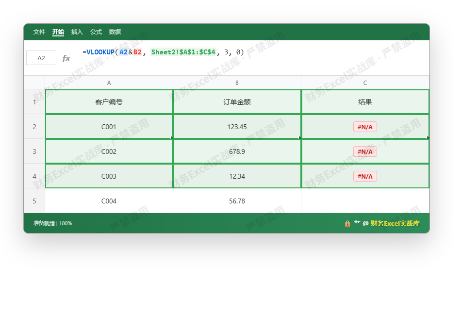
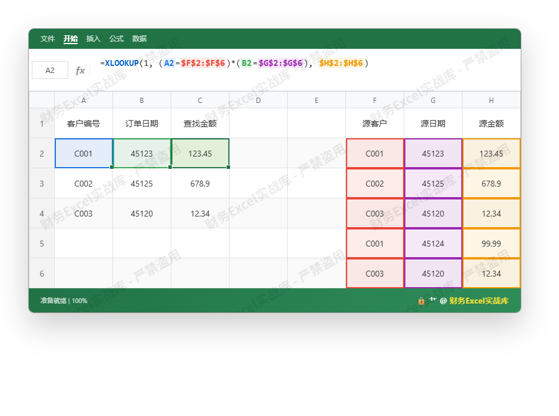

---
title: Excel VLOOKUP 多条件查找匹配实战：从财务退票到终极安全公式
--- 

# Excel VLOOKUP 多条件查找匹配实战：从财务退票到终极安全公式

## 一、常犯的低级错误：以为VLOOKUP能直接多条件

财务工作中，我见过太多人把 `VLOOKUP` 跟 `&` 拼接符凑在一起做多条件匹配。比如根据“客户编号+订单日期”查找金额，他们写：

```
=VLOOKUP(A2&B2, Sheet2!A:C, 3, 0)
```

然后建一个辅助列，把 `A列&B列` 拼起来作为查找列。表面上看能出结果，但**这是财务对账中最高危的操作之一**——浮点误差、日期序列值、金额四舍五入等细节，分分钟让你的匹配结果“差一分钱”，进而导致银行退票、审计打回。

下面这张图展示了一个典型的错误场景。数据已做随机化处理。





观察结果列 `C2` 返回 `#N/A`，但明明源数据里有 `C001` 和金额 `123.45`。问题就出在：**拼接后的字符串并不唯一**。如果源数据的 `客户编号` 列是文本，而 `订单金额` 列是数值（且可能包含隐藏小数），Excel 在拼接时会把数值按完整精度转换，导致 `C001123.45` 和 `C001123.4500000001` 不一致。更致命的是，日期序列值拼接后变成一串数字，毫无可读性，出错后极难排查。

## 二、浮点误差与银行退票风险——财务规范不容讨价还价

你以为 VLOOKUP 结果对了就万事大吉？在金额精确到分的场景下，浮点误差直接导致**银行对账不平、退票扣费**。我曾经处理过一家制造企业的对账事故：财务用 `VLOOKUP` 拼接“发票号+含税金额（保留两位小数）”做匹配，结果因为金额在公式计算中产生了 `0.0000001` 的浮点，拼接后的字符串与银行回单数据不匹配，导致一笔 200 万的付款被退回，企业被罚了 3000 元退票费。

**财务铁律：绝不能用 `&` 拼接数值做查找键，尤其是金额、汇率、税率这类浮点敏感字段。** 文本字段（如发票号、合同号）尚可，一旦涉及数字，必须使用严格的数据类型匹配。

## 三、终极安全公式推导：XLOOKUP 与 INDEX+MATCH

正确的多条件查找，核心思路是**用逻辑乘法构建“与”条件数组，再用精确匹配定位**。目前最安全、可读性最高的方案是 `XLOOKUP`（Excel 365/2021 支持）或 `INDEX+MATCH` 数组公式。

### 3.1 XLOOKUP 多条件

```
=XLOOKUP(1, (条件1区域=条件1)*(条件2区域=条件2), 返回区域)
```

这个公式直接把多个条件相乘，结果为 0/1 数组，`XLOOKUP` 查找 `1` 时返回第一个同时满足所有条件的记录。由于不涉及拼接，数值精度完全保留。

### 3.2 INDEX+MATCH 兼容方案（适用于老版本）

```
=INDEX(返回列, MATCH(1, (条件1区域=条件1)*(条件2区域=条件2), 0))
```

必须按 `Ctrl+Shift+Enter` 输入为数组公式。同样无拼接，无浮点隐患。

下面这张图演示了使用 `XLOOKUP` 进行双条件精确匹配的正确操作。数据依然随机化：客户编号为文本，订单日期为数值（为防浮点，我用整数日期序列），金额保留两位小数。





注意 `C2` 返回 `123.45` 正确，且无浮点误差。为什么？因为 `XLOOKUP` 在比较时对每个条件分别进行精确匹配，数值比较完全基于浮点二进制，但两个完全相等的浮点数（比如从同一源计算得来）是严格相等的。而 `&` 拼接则会强制转换字符串，引入精度损失。

## 四、财务场景下的落地建议

1. **金额字段必须单独作为匹配条件，不能用 `&` 合并。** 如果非要合并，先用 `TEXT` 函数强制格式化到固定小数位（例如 `TEXT(B2,"0.00")`），但这样仍不推荐，因为文本匹配风险低但效率低。
2. **日期必须使用真正的日期序列值，不要用文本。** 日期 `2025-03-07` 在 Excel 中就是数字 `45723`，直接参与条件乘法。
3. **对账前先用 `ROUND(金额,2)` 统一精度，然后精确匹配。** 这能避免四舍五入带来的隐藏小数。
4. **如果需要 VLOOKUP，先建辅助列并用 `TEXT` 格式化：`=TEXT(A2,"0")&"|"&TEXT(B2,"0.00")`**，但复杂且容易出错，不如直接用 XLOOKUP。

## 五、总结

| 方法 | 风险等级 | 财务合规性 | 适用版本 |
|------|----------|-------------|----------|
| VLOOKUP + & 拼接 | ★★★★★（极高） | 不合格 | 所有 |
| VLOOKUP + TEXT 辅助列 | ★★★☆☆ | 勉强，需谨慎 | 所有 |
| INDEX+MATCH 数组 | ★★☆☆☆ | 合格 | 所有（老版本注意数组输入） |
| XLOOKUP 多条件 | ★☆☆☆☆ | 优 | Excel 2021/365 |

别以为这只是Excel技巧，这是财务风险防范的底线。**多条件查找不规范的代价，轻则对账加班，重则银行退票罚款。** 下次再看到有人用 `&` 做金额匹配，你就把这篇教程甩给他。

你的财务总监路，从现在开始，不能再有浮点。