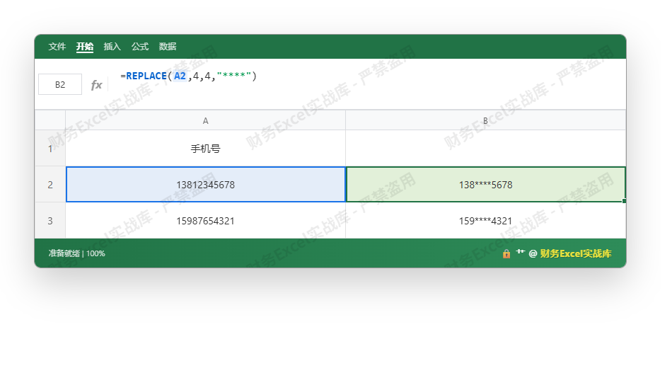

## 用 Excel 隐藏手机号中间四位星号：从嵌套暴力到 LET 逻辑重构

在处理客户隐私数据时，经常需要将手机号中间四位替换为 `*`，既保留前三位和后四位可读，又防止敏感信息泄露。Excel 有多种实现方式，但不同版本的函数能力差异巨大。本文从最直观的 `REPLACE` 公式讲起，逐步拆解数据流，再引入 `LET` + 动态数组构建现代化、可调试的方案。

### 基础版：REPLACE 硬切割（适用于所有版本）

手机号为 11 位文本，隐藏中间四位即保留 `LEFT(3)` 和 `RIGHT(4)`，用 `REPT("*",4)` 填充中间。最直接的公式：

```excel
=REPLACE(A2,4,4,"****")
```

- `REPLACE` 的第三个参数 `4` 指定替换长度，第四个参数 `"****"` 替换内容
- 等效于 `LEFT(A2,3) & "****" & RIGHT(A2,4)`，但 `REPLACE` 更简洁

**底层逻辑**：`REPLACE(old_text, start_num, num_chars, new_text)` 将字符串视为字符数组，删除 `start_num` 起 `num_chars` 个字符后插入新文本。此处直接替换四位，无需手动拼接。

**实操演示图**：原始手机号列与公式输入





拖动填充句柄后，所有手机号均变为前3+****+后4 格式。该方法简单，但公式本身无法动态处理空值或非11位号码。

### 数据清洗：处理异常输入（非 11 位、含空格）

原始数据可能混入空格或长度错误。用 `TRIM` 和 `LEN` 做前置校验，再执行替换。典型的防御式写法：

```excel
=IF(LEN(TRIM(A2))=11, REPLACE(TRIM(A2),4,4,"****"), "无效号码")
```

- 先用 `TRIM` 去首尾空格及多余空白
- 判断长度是否为 11，否则返回提示
- 可以配合 `ISNUMBER` 检查是否为数字串，但手机号可能包含 `+86` 前缀，本例简化

**嵌套函数执行顺序**：Excel 从最内层 `TRIM` 开始计算，结果传递给 `LEN` 和 `REPLACE`，`IF` 判断后输出。

### 现代版：LET 变量声明 + 动态数组（Office 365）

当需要批量处理大量手机号且希望公式可读性强时，`LET` 可以定义中间变量，避免重复计算 `TRIM(A2)`。同时结合 Excel 365 的自动溢出特性，只需在首个单元格输入一次公式即可填充整列。

假设数据位于 **A2:A100**，想在新列 **B2#** 输出结果（需要先选中 B2 并确认公式自动溢出）。

```excel
=LET(
    手机, TRIM(A2:A100),
    掩码, IF(LEN(手机)=11, REPLACE(手机,4,4,"****"), "无效")
)
```

**拆解**：
- `手机` 变量：一次性计算所有单元格的 `TRIM`，生成动态数组
- `掩码` 变量：基于 `手机` 数组判断，同样返回数组
- 最终结果自动溢出到相邻行，无需手动拖动

相比传统 `IF` + `REPLACE` 向下填充的逻辑，`LET` 让数据流动更清晰：

```
输入 A2:A100 → TRIM → 手机
                 ↓
            LEN检查 → 替换/无效 → 掩码
```

若需要将结果保留为文本并合并到其他处理，可以用 `TEXTJOIN` 再做聚合，但此处聚焦单列掩码。

**实操演示图**：展示 LET 公式及溢出结果

[[IMAGE_DATA:{"formula_bar": "=LET(手机,TRIM(A2:A5),掩码,IF(LEN(手机)=11,REPLACE(手机,4,4,\"****\"),\"无效\"),掩码)", "cells": {"A1": "原始号码", "A2": " 13912345678 ", "A3": "15876543210", "A4": "17788889999", "A5": "12345", "B2": "139****5678", "B3": "158****3210", "B4": "177****9999", "B5": "无效"}, "highlight": ["B2"], "rows_count": 5, "cols_count": 2}]```

注意 B 列仅需要 B2 一个公式，Excel 365 会自动向下填充到与 A 列行数匹配（基于溢出范围）。

### 底层逻辑扩展：如果手机号格式不一（含区号或前后缀）

实际业务中可能遇到 `+86 13812345678` 或 `138-1234-5678` 等变体。此时不能简单固定位置替换，需要提取连续数字部分。一个通用的思路：

1. 用 `MID` 配合 `ROW` 迭代筛选数字字符
2. 重组为纯数字串
3. 再执行 `REPLACE`

但这不是本文重点。若遇到此类需求，可参考下面的 **算法思维** 曲线：

```
提取数字 → 判断长度 → 替换中间四位 → 返回原格式（保留非数字字符的占位？）
```

简单的折中方案：使用 `SUBSTITUTE` 去除 `-`、` `、`+`, 然后只对纯数字部分替换。但原格式会丢失，通常业务允许只显示前3后4，故直接隐藏即可。

### 性能考量：数组运算 vs 逐个单元格

- 对于 10,000 行数据，传统 `REPLACE` 填充公式需要 10,000 次计算，每个公式独立执行 `TRIM`
- 现代 `LET` + 动态数组只在内存中计算一次 `TRIM(A2:A10000)`，后续 `IF` 操作均为向量化运算，性能优越
- 注意：`LET` 中的变量若引用整个列（如 `A:A`），可能造成溢出范围不确定性，建议指定实际行数或使用结构化引用（`Table1[手机号]`）

### 总结

| 场景                     | 推荐公式                                                                 |
|--------------------------|--------------------------------------------------------------------------|
| 简单隐藏（旧版 Excel）    | `=REPLACE(A2,4,4,"****")`                                                |
| 需校验长度（所有版本）    | `=IF(LEN(TRIM(A2))=11,REPLACE(TRIM(A2),4,4,"****"),"无效")`              |
| 批量处理 + 可读性（365）  | `=LET(手机,TRIM(A2:A100),IF(LEN(手机)=11,REPLACE(手机,4,4,"****"),"无效"))` |

从单一函数 `REPLACE` 到嵌套 `IF` + `TRIM`，再到 `LET` 变量声明的模块化写法，体现了 Excel 公式从“一次性粘贴”到“数据管道”的演进。当数据结构复杂时，建议优先考虑 `LET` 分离计算步骤，便于调试和维护。

最后，所有公式均以通用方式呈现，不依赖 RAM 或特定区域设置。企业环境中若需自动化，可进一步结合 Power Query 或 VBA 实现，但那已超出本文范围。