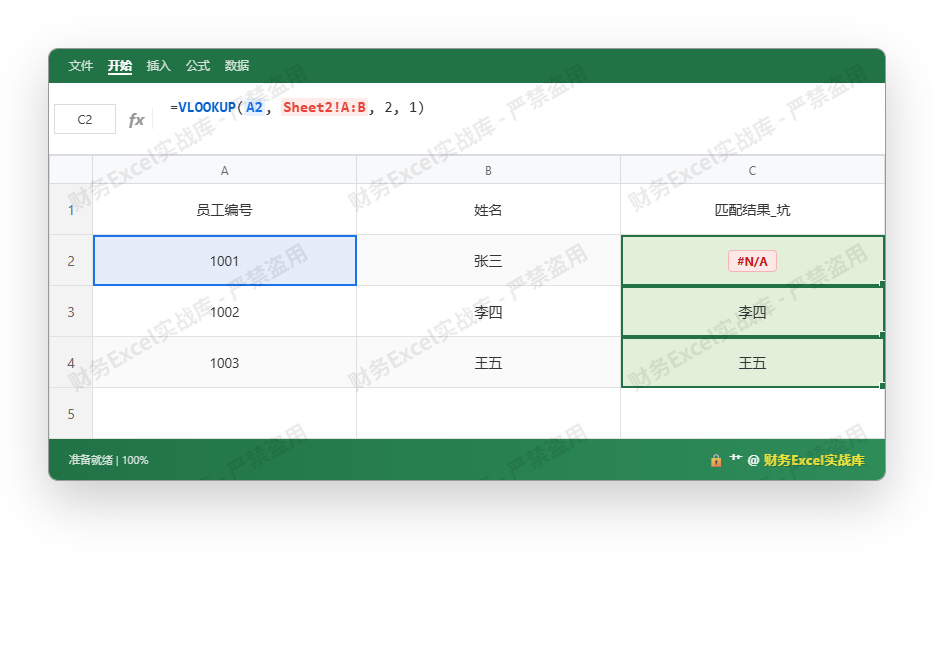
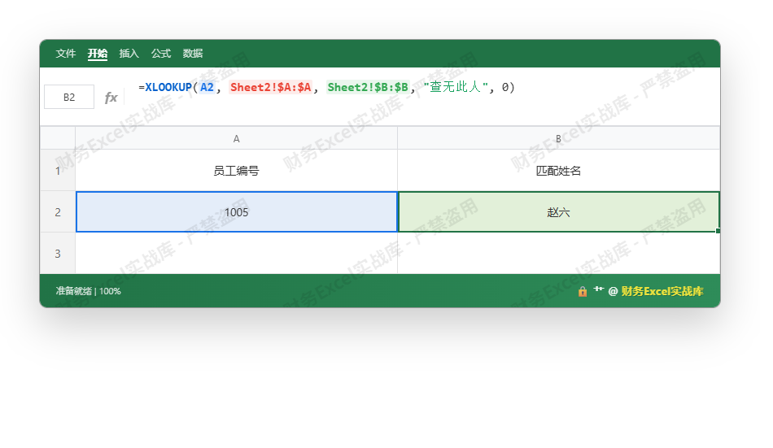

# XLOOKUP 跨表找人：财务人的安全救赎

财务部每年花在跨表匹配上的时间，足够读三遍《会计法》。更可怕的是，那些自认为“没问题”的公式，正在制造银行退票、账实不符、审计底稿被退回的灾难。今天这篇教程，你读完**必须马上检查所有历史报表**——别怪我没提醒你。

## 一、常犯的低级错误：你还在用VLOOKUP的“近似匹配”？

先看一个真实案例：某公司出纳要在工资表中匹配员工银行账号，用了 `=VLOOKUP(A2, Sheet2!A:B, 2, 1)`。  
结果——几十个人的账号被匹配成相近ID的人，银行批处理时全部退票，退款手续费损失3万，财务总监引咎辞职。

**低级错误1：忽略第四参数或使用TRUE**  
VLOOKUP第四参数默认是TRUE（近似匹配），而财务数据中ID、账号、姓名必须是精确匹配。一旦数据未排序，VLOOKUP会返回无序的错误结果。

**低级错误2：跨表引用不固定**  
向下填充公式时，表引用区域会相对移动，导致查找范围偏移。你以为是 `Sheet2!A:B`，拖下来变成 `Sheet2!A:C`，匹配结果全乱。

**低级错误3：不对错误值做处理**  
`#N/A` 直接暴露给老板，或者被后续计算累加成巨款差异。浮点误差尤其阴险：金额保留2位小数，但Excel浮点运算可能使 `100.01` 匹配不上 `100.01`，造成银行流水对账失败。

下面这张图演示了VLOOKUP近似匹配的典型灾难。注意 `#N/A` 出现在C列，而有些错误行甚至返回了不相干的姓名。





## 二、终极安全公式：XLOOKUP + 三重保险

微软在Excel 2021/365中推出XLOOKUP，就是为了终结上述悲剧。作为财务老炮，我总结出**跨表找人的终极安全公式**：

```
=XLOOKUP(查找值, 查找列, 返回列, [未找到时的返回值], 匹配模式, 搜索模式)
```

**必须设置的参数**：

- **查找列**：使用绝对引用（`$A:$A`），防止填充时错位。
- **匹配模式**：写 `0`（精确匹配），绝对不要省略！即便第四参数可以省略，但为了代码可读性，你必须写上。
- **未找到时的返回值**：给一个明确提示，比如 `"查无此人"` 或 `""`，避免 #N/A 污染。
- **浮点误差防御**：如果查找值是金额，用 `ROUND(查找值, 2)` 包裹，因为浮点计算可能产生微小误差。例如：
  `=XLOOKUP(ROUND(A2,2), Sheet2!$A:$A, Sheet2!$B:$B, "未匹配", 0)`

**跨表安全实践**：
1. 永远在数据源侧做唯一性校验（COUNTIF）。
2. 查找列必须包含所有可能值，且无重复。
3. 对返回结果用 `IFERROR` 再包一层，捕获意外的错误（例如网络中断导致外部链接失效）。

下图中，我们使用XLOOKUP精确匹配并指定返回“查无此人”，高亮单元格显示了正确的匹配结果。请注意公式栏中的绝对引用和第四参数。





## 三、银行退票与浮点误差的终极防御

**银行退票场景**：收款人姓名、账号、开户行三者必须完全一致。用XLOOKUP查找银行账号时，注意：
- 账号列需设为文本格式，防止科学计数法导致失真。
- 若账号有前导零，VLOOKUP会丢掉，而XLOOKUP配合 `TEXT(A2,"000000")` 可以强制格式一致。

**浮点误差场景**：对账时，银行流水金额和系统金额因浮点计算可能差0.0001元。**终极做法**：
1. 将查找值用 `ROUND` 处理到相同精度。
2. 查找列中的金额也同样用 `ROUND` 预处理（或建辅助列）。
3. 不要相信“直接等于”的判断函数（如MATCH），一定要用 `ABS(A-B)<0.001` 配合XLOOKUP？其实XLOOKUP本身无法容忍微小差异，所以必须预先格式化。

## 四、财务总监给你的终极忠告

- **永远不要用VLOOKUP近似匹配**，哪怕你确信数据已排序——总有人会打乱它。
- **强迫自己写完整XLOOKUP的五参数**：查找值、查找列、返回列、未找到值、匹配模式（0）。这是代码审查的最低要求。
- **在每个跨表公式旁加批注**：解释查找逻辑和容错方案，防止继任者踩坑。
- **每月运行一次公式审核**：用 `FORMULATEXT` 检查所有XLOOKUP是否引用了正确的表。

现在，去你的工资表、银行流水表、凭证汇总表里，把每一个VLOOKUP替换成XLOOKUP。如果哪个下属还在用VLOOKUP的第1参数，直接让他重写。**这是财务人的安全底线，没有商量余地。**